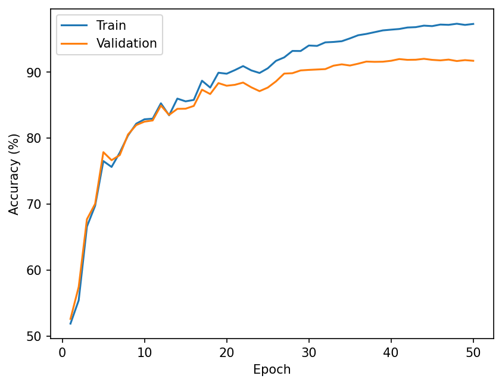
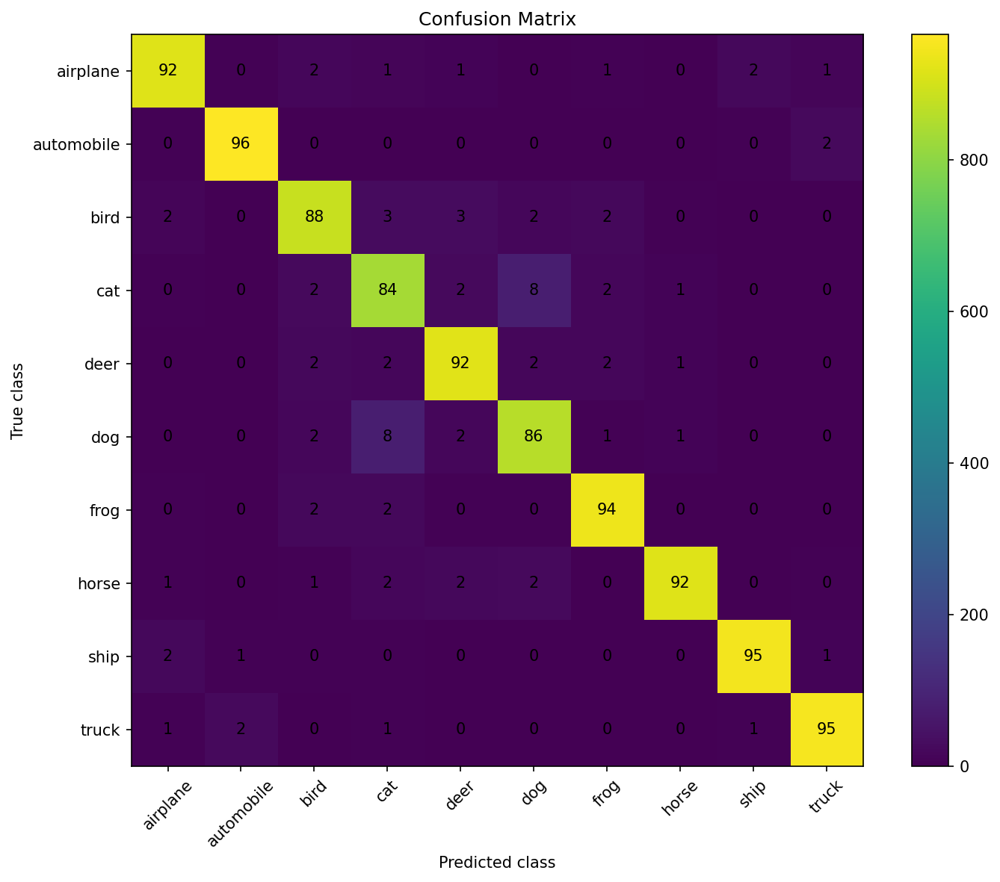

# CIFAR-10 Image Classification with PyTorch

An introductory deep-learning project built to practice sound experimental methodology: implementing CNNs, separating training, validation and test data, comparing controlled training choices, and examining errors. The goal is to learn from repeatable experiments, not to claim state-of-the-art CIFAR-10 accuracy.

## Objectives

- Implement and compare two CNNs from scratch.
- Study optimization, learning-rate scheduling and regularization.
- Select checkpoints with validation data, then report test performance separately.
- Measure variability across random seeds and inspect class-level errors.

## Dataset and split

CIFAR-10 contains 60,000 colour images of size 32×32 in 10 classes. The 50,000-image training set is split into 45,000 training examples and 5,000 validation examples using a deterministic index permutation seeded with 42. The official 10,000-image test set is reserved for final evaluation. The split remains fixed across runs; model initialization varies by run seed.

Images are converted to tensors and normalized channel-wise with means `(0.4914, 0.4822, 0.4465)` and standard deviations `(0.2470, 0.2435, 0.2616)`. Validation and test data use normalization only.

## Data augmentation

Training images use `RandomCrop(32, padding=4)` and `RandomHorizontalFlip`. The final configuration also applies `RandomErasing(p=0.25)` after tensor conversion and normalization. Augmentation is not applied to validation or test images.

## Models

Both models are implemented from scratch in `src/model.py` and use BatchNorm and ReLU.

- **SimpleCNN — 620,810 parameters:** three convolutional stages with 32, 64 and 128 channels, each followed by 2×2 max pooling. A flattened feature map feeds a 256-unit fully connected layer, dropout (`p=0.2`) and the 10-class output layer.
- **MiniResNet — 696,618 parameters:** a 32-channel convolutional stem and three stages of two residual blocks each (32, 64 and 128 channels). Strided blocks downsample and use a 1×1 convolution plus BatchNorm to match shortcut dimensions when needed. Each block adds the shortcut to its two-convolution main path. Adaptive global average pooling reduces the final feature map to one value per channel, followed by dropout (`p=0.2`) and a linear classifier.

These models differ in depth, residual blocks, pooling and classifier structure, so their results do not isolate the effect of residual connections alone.

## Training setup

The final MiniResNet configuration uses Adam (`lr=1e-3`, `weight_decay=1e-4`), `CosineAnnealingLR`, 50 epochs and batch size 64. Cross-entropy is the training loss. The training loop tracks validation accuracy and saves an improving checkpoint as `best_model.pth`. It also writes the final epoch as `best_model_seed{seed}.pth`; the evaluation script loads this per-seed file. The reported test results therefore correspond to those per-seed checkpoints. The test set is not used for model selection.

## Experimental methodology

The experiments compare models and training choices while holding the fixed train/validation split and evaluation process constant. Multi-seed runs use seeds 42, 123 and 456. Validation results guide configuration choices; final test results are reported separately.

## Experiment results

| Experiment | Result | Decision |
|---|---:|---|
| Initial MiniResNet, 15 epochs | 87.39% test accuracy | Initial baseline |
| Adam vs. SGD with momentum | Adam converged faster; after 50 epochs, both reached roughly 91–92% validation accuracy | Adam used for final configuration |
| Label smoothing (`0.1`) | No validation improvement | Rejected |
| Weight decay increased from `1e-4` to `5e-4` | Best validation accuracy: 91.72% | Kept `1e-4` |
| Random Erasing (`p=0.25`) | Mean validation accuracy 92.13%, versus 91.74% without it across three seeds | Kept; modest mean improvement |

## Multi-seed results

| Model / setting | Seed 42 | Seed 123 | Seed 456 | Mean | Sample standard deviation |
|---|---:|---:|---:|---:|---:|
| SimpleCNN validation accuracy | 85.56% | 85.68% | 86.14% | 85.79% | ≈0.31 percentage points |
| MiniResNet, no Random Erasing (validation) | 92.00% | 91.68% | 91.54% | 91.74% | — |
| MiniResNet, Random Erasing `p=0.25` (validation) | 91.88% | 92.12% | 92.40% | 92.13% | — |

## Final test performance

The selected MiniResNet checkpoints achieved:

| Seed | Test accuracy |
|---:|---:|
| 42 | 91.34% |
| 123 | 91.53% |
| 456 | 91.42% |
| **Mean** | **91.43%** |
| **Sample standard deviation** | **≈0.10 percentage points** |



*Training and validation accuracy for a representative run of the final MiniResNet setup.*

## Error analysis

The normalized confusion matrices show cat and dog as the hardest pair: about 8% of cats are predicted as dogs, and about 7–8% of dogs as cats. Bird is also relatively difficult. Automobile, ship and truck are among the strongest classes. These patterns are stable across all three seeds.



*Final test-set confusion matrix for seed 42; rows show true classes and columns show predicted classes.*

## Main lessons learned

- Keep validation-based model selection separate from final test evaluation.
- Run multiple seeds: a single result can hide meaningful run-to-run variation.
- Optimizer comparisons depend on training duration; faster early convergence did not mean SGD could not catch up.
- Regularization is empirical: Random Erasing helped modestly on average, while label smoothing and stronger weight decay did not improve validation performance in these experiments.
- Aggregate accuracy is not the whole story; confusion matrices reveal persistent class-specific errors.

## Repository structure

```text
.
├── src/
│   ├── dataset.py       # CIFAR-10 transforms, split and data loaders
│   ├── model.py         # SimpleCNN, ResidualBlock and MiniResNet
│   ├── train.py         # Seeded training, validation and checkpointing
│   └── evaluate.py      # Test evaluation and confusion matrix
├── train_*.sbatch       # SLURM training jobs for seeds 42, 123 and 456
├── evaluate_*.sbatch    # SLURM evaluation jobs for the three seeds
├── accuracy*.png        # Saved training curves, including optimizer comparison
└── confusion_matrix_seed*.png
```

## How to run

Install the packages in `requirements.txt` in a Python environment with PyTorch and torchvision. Place the CIFAR-10 dataset under `./data` in the layout expected by torchvision; the loaders use `download=False`.

From the repository root, train a model and evaluate its per-seed checkpoint:

```bash
python src/train.py --seed 42
python src/evaluate.py --seed 42
```

Repeat with `--seed 123` or `--seed 456` for the reported multi-seed runs. Training writes `best_model.pth`, `best_model_seed{seed}.pth` and `accuracy.png`; evaluation reads the per-seed checkpoint and writes `confusion_matrix_seed{seed}.png`. SLURM examples are provided in the corresponding `.sbatch` files.

## Conclusion

This project demonstrates a complete, reproducible CIFAR-10 workflow: build models, make controlled validation-led decisions, evaluate selected checkpoints on held-out test data, and use multi-seed and class-level analysis to understand the results. The roughly 91.4% mean test accuracy is a useful outcome of that learning process, not a state-of-the-art claim.
